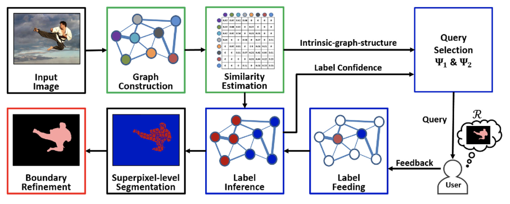

# 1-bit Feedback Music Recommendation System

 
Customize a playlist based on user's feedback on a subset of per-selected songs.
 

## Computer vision-inspired, deep learning-powered

Imagine different songs are different points in a space, our goal is to determine which "segment of space" consists of songs that users like.

Q: How to turn a song into a point?

A: Calculate a song's [spectrogram](https://en.wikipedia.org/wiki/Spectrogram) (an image) first. Then we use CNN + autoencoder; the intermediate output of the network, a vector, is essentially a point in an high-dimensional space.

Q: How to segment the area of songs user like?

A: We adopt a [technique](https://link.springer.com/article/10.1007/s00138-018-0923-1) that is used in graph segmentation tasks. This technique incorporates experts's (your!) feedback to refine the boundary of the space, and this is where 1-bit feedback (like or dislike) comes into play.

## 10 music genres -- songs downloaded using Spotify api

We use Bigroom, Blues, Classical, Country, Disco, Dubstep, Hiphop, Lofi, Metal, Techno; all of them are our favorite genres.

## Result

The recommendation accuracy is above 70% on Bigroom and Dubstep, both of them are electronic dance music sub-genres.

